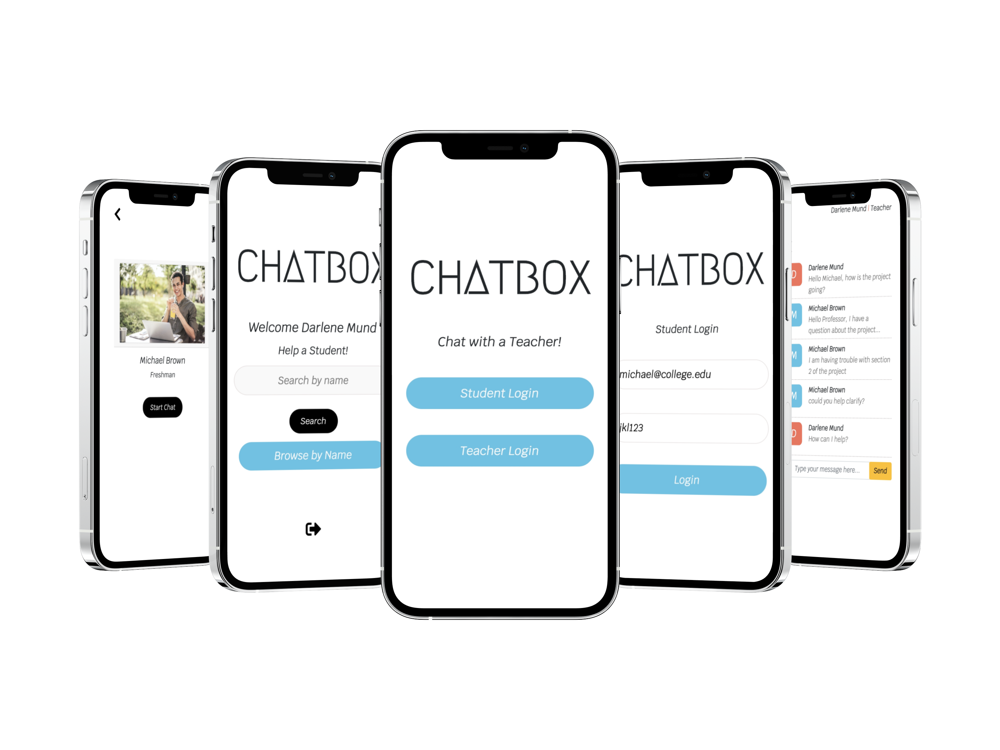

# Student Teacher Chat Application

Live Preview: [Chatbox](https://student-teacher-chat.herokuapp.com/)

A full-stack chat application for students and teachers to communicate with during school hours. Realtime communication is established using Socket.io, PostgreSQL utilized for storing, updating, and making changes to messages.

### Technologies Used:

  Socket.io, React, Node.js, PostgreSQL, Express, and Bootstrap
